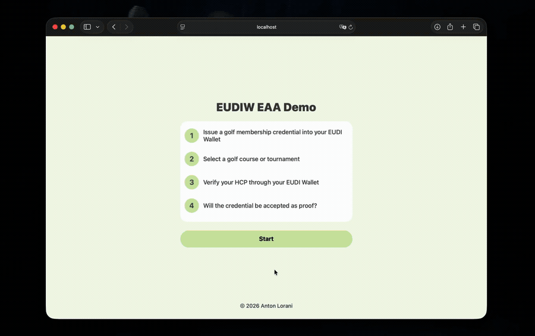
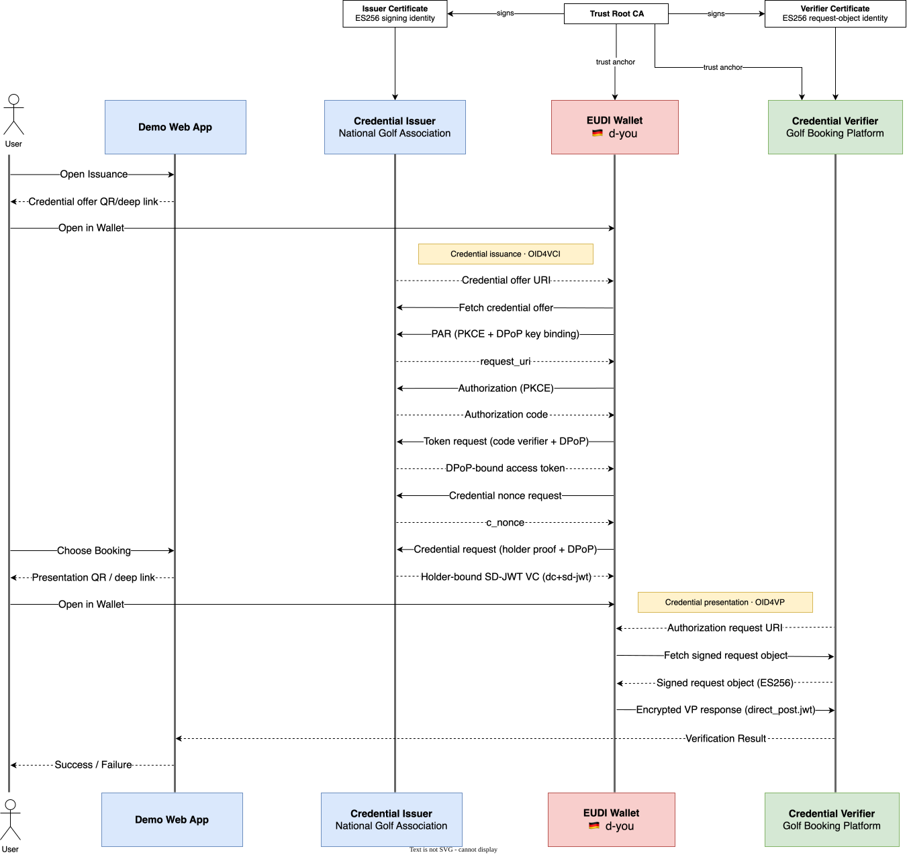

TL;DR This project is a practical demonstration of issuance (OID4VCI) and verification (OID4VP) of a custom credential (SD-JWT VC) through the "d-you" EUDI Wallet in the area of golf membership credentials.

## Abstract

Playing at a golf course or participating in a tournament mostly requires golfers to prove their handicap index and/or golf club membership to a third party.  These credentials are managed by national golf associations, making them difficult to use across borders without manual verification or the exchange of supporting documents.

This EUDIW use case addresses that gap by issuing golf membership credentials to an EUDI Wallet and verifying them as part of a golf course or tournament booking.  By applying selective disclosure, the verifier receives only the information required to confirm eligibility, instead of exposing the holder’s complete credential.

## Overview



The following SD-JWT VC represents a golf membership credential, it supports selective-disclosure for common queries such as HCP ≤ 36 checks, which is a very common threshold among golf course HCP restrictions.

```json
{
  "iss": "https://localhost:8443",
  "iat": 1790092800,
  "exp": 1821628800,
  "vct": "urn:de.antonlorani:golf_membership:1",
  "cnf": {
    "jwk": {
      "kty": "EC",
      "crv": "P-256",
      "x": "x",
      "y": "y"
    }
  },
  "document_number": "GM-2026-000002",
  "given_name": "John",
  "family_name": "Doe",
  "hcp_index": 12.0,
  "is_hcp_below_37": true,
  "club_name": "Royal St. Andrews Links",
  "membership_valid_until": "2027-12-31"
}
```

# License

Copyright (C) 2026 Anton Lorani

Licensed under the Apache License, Version 2.0 (the "License");
you may not use this file except in compliance with the License.
You may obtain a copy of the License at

<https://www.apache.org/licenses/LICENSE-2.0>

Unless required by applicable law or agreed to in writing, software
distributed under the License is distributed on an "AS IS" BASIS,
WITHOUT WARRANTIES OR CONDITIONS OF ANY KIND, either express or implied.
See the License for the specific language governing permissions and
limitations under the License.
